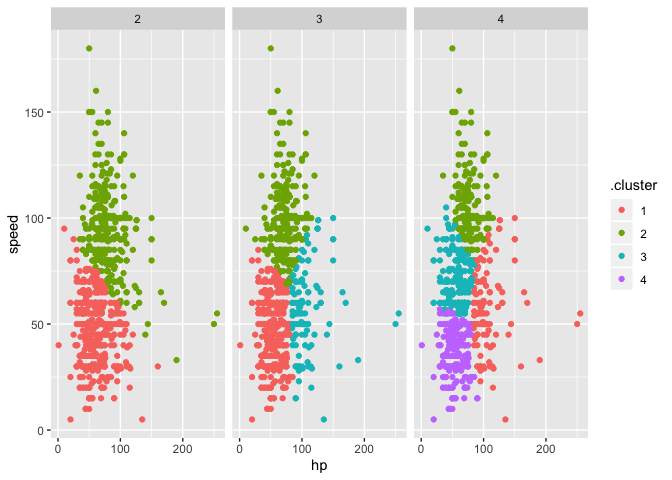

Statistical learning
================
Ngoc Duong - nqd2000
11/26/2019

``` r
set.seed(11)
bwt_df = 
  read_csv("./extra_topic_data/birthweight.csv") %>% 
  janitor::clean_names() %>%
  mutate(
    babysex = as.factor(babysex),
    babysex = fct_recode(babysex, "male" = "1", "female" = "2"),
    frace = as.factor(frace),
    frace = fct_recode(frace, "white" = "1", "black" = "2", "asian" = "3", 
                       "puerto rican" = "4", "other" = "8"),
    malform = as.logical(malform),
    mrace = as.factor(mrace),
    mrace = fct_recode(mrace, "white" = "1", "black" = "2", "asian" = "3", 
                       "puerto rican" = "4")) %>% 
  sample_n(200)
```

To use lasso, we’ll look at the `glmnet` package… Get inputs for
`glmnet`

``` r
y = bwt_df$bwt

#need to get the x design matrix (matrix of all predictors):
x = model.matrix(bwt~., bwt_df)[,-1]
```

Fit lasso regression

``` r
lambda = 10^(seq(3, -2, -0.1))

#glmnet (set lambda, otw R will pick default lambda)
lasso_fit = 
  glmnet(x, y, lambda = lambda)

lasso_cv =
  cv.glmnet(x, y, lambda = lambda)

lambda_opt = lasso_cv$lambda.min
```

``` r
broom::tidy(lasso_fit) %>% 
  select(term, lambda, estimate) %>% 
  complete(term, lambda, fill = list(estimate = 0)) %>% #as lambda goes up, the estimate approaches 0 and vice versa 
  filter(term != "(Intercept)") %>% 
  ggplot(aes(x = log(lambda, 10), y = estimate, group = term, color = term)) + 
  geom_path() + 
  geom_vline(xintercept = log(lambda_opt, 10), color = "blue", size = 1.2) +
  theme(legend.position = "bottom")
```

<!-- -->

Cross-validation
stuff

``` r
broom::tidy(lasso_cv) %>%  #to obtain cross-validated prediction error at a certain lambda value
  ggplot(aes(x = log(lambda, 10), y = estimate)) + 
  geom_point()  
```

<!-- -->

We can see cross-validated prediction error is optimized (lowest) at
around 1.1-1.2. This value can be found by `lambda_opt =
lasso_cv$lambda.min`.

Lasso is useful when the goal is to make accurate predictions as opposed
to making inference. Applications seen in propensity score (probability
a subject takes a treatment) in health settings.

#### Clustering: Pokemon

``` r
poke_df = 
  read_csv("./extra_topic_data/pokemon.csv") %>% 
  janitor::clean_names() %>% 
  select(hp, speed)

#take a first look at the data
poke_df %>% 
  ggplot(aes(x = hp, y = speed)) + 
  geom_point()
```

<!-- -->

Let’s cluster something…

``` r
kmeans_fit =
  kmeans(x = poke_df, centers = 3)
```

Process and plot results

``` r
poke_df =
  broom::augment(kmeans_fit, poke_df)

poke_df %>% 
  ggplot(aes(x = hp, y = speed, color = .cluster)) +
  geom_point()
```

<!-- -->

Map across a few difference choices of cluster number,

``` r
clusts =
  tibble(k = 2:4) %>%
  mutate(
    km_fit =    map(k, ~kmeans(poke_df, .x)),
    augmented = map(km_fit, ~broom::augment(.x, poke_df))
  )

clusts %>% 
  select(-km_fit) %>% 
  unnest(augmented) %>% 
  ggplot(aes(hp, speed, color = .cluster)) +
  geom_point(aes(color = .cluster)) +
  facet_grid(~k)
```

<!-- -->

### Clustering: trajectories

``` r
traj_data = 
  read_csv("./extra_topic_data/trajectories.csv")

traj_data %>% 
  ggplot(aes(x = week, y = value, group = subj)) + 
  geom_point() + 
  geom_path()
```

<!-- -->

This example uses longitudinally observed data. The process would be:

1.  For each subject, estimate a simple linear regression
2.  Extract the intercept and slope
3.  Cluster using the intercept and slope

<!-- end list -->

``` r
int_slope_df = 
  traj_data %>% 
  nest(data = week:value) %>% 
  mutate(
    models = map(data, ~lm(value ~ week, data = .x)),
    result = map(models, broom::tidy)
  ) %>% 
  select(subj, result) %>% 
  unnest(result) %>% 
  select(subj, term, estimate) %>% 
  pivot_wider(
    names_from = term,
    values_from = estimate
  ) %>% 
  rename(int = "(Intercept)", slope = week)
```

Try to k-means this…

``` r
km_fit = 
  kmeans(
    x = int_slope_df %>% select(-subj) %>% scale, 
    centers = 2)

int_slope_df =
  broom::augment(km_fit, int_slope_df)
```

Try to plot the clusters…

``` r
int_slope_df %>% 
  ggplot(aes(x = int, y = slope, color = .cluster)) +
  geom_point()
```

<!-- -->

Add cluster assignment to the original trajectory data to get new
spaghetti plot…

``` r
left_join(traj_data, int_slope_df) %>% 
  ggplot(aes(x = week, y = value, group = subj, color = .cluster)) + 
  geom_point() + 
  geom_path() 
```

<!-- -->
